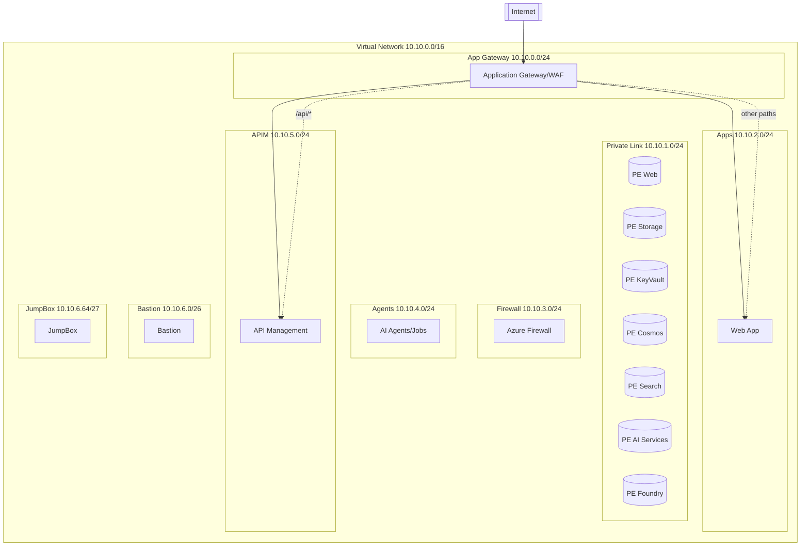

# Azure AI Foundry Baseline Infrastructure (Secure)

[](https://www.terraform.io/)
[](https://azure.microsoft.com/)
[](LICENSE)

## 🚀 Overview

This Terraform infrastructure project deploys a **secure, production-ready Azure AI Foundry baseline architecture** following Microsoft's best practices for enterprise AI workloads. The infrastructure is designed with security-first principles, implementing private networking, WAF protection, and comprehensive monitoring capabilities.

## 🏗️ Architecture

### High-Level Architecture Diagram



### Updated Traffic Flow (Single-Phase HTTPS)
1. Client -> Application Gateway (WAF) over HTTPS (certificate provisioned in same apply).
2. HTTP (port 80) exists only to permanently redirect to HTTPS.
3. Path-based routing: `/api/*` -> internal APIM; all other paths -> Web App.
4. APIM consumes OpenAI and other services via Private Endpoints only.
5. Operational access: Bastion -> JumpBox (or optional P2S VPN) for internal tests (e.g. curl to internal APIM gateway).

## 🔧 Key Components

### 🛡️ Security & Networking
- **Virtual Network**: Isolated network with multiple subnets for different tiers
- **Private Endpoints**: All Azure services accessible only through private networking
- **Private DNS Zones**: Automatic DNS resolution for private endpoints
- **Azure Firewall**: Centralized egress filtering and logging
- **Application Gateway + WAF**: Web Application Firewall protection with OWASP rules
- **Network Security**: Public network access disabled on all data services

### 🤖 AI & Machine Learning
- **Azure AI Foundry Hub**: Centralized AI workspace for model management
- **Azure AI Foundry Project**: Project-specific AI environment
- **Azure AI Services**: Cognitive services for various AI capabilities
- **Azure AI Search**: Intelligent search with vector capabilities

### 💾 Data & Storage
- **Azure Storage Account**: Secure blob and file storage with GRS replication
- **Azure Cosmos DB**: NoSQL database with global distribution capabilities
- **Azure Key Vault**: Secure secret and key management with purge protection

### 📊 Application Platform
- **Azure App Service**: Linux-based web application hosting
- **VNet Integration**: Secure outbound connectivity for web applications
- **System-Assigned Managed Identity**: Passwordless authentication

### 📈 Observability
- **Log Analytics Workspace**: Centralized logging and monitoring
- **Application Insights**: Application performance monitoring and analytics

## 🏷️ Resource Naming Convention

All resources follow a consistent naming pattern:
- **Prefix**: `aibaseln` (configurable via `ai_prefix` variable)
- **Format**: `{prefix}-{service-type}`
- **Examples**: 
  - `aibaseln-foundry` (AI Foundry Hub)
  - `aibaseln-kv` (Key Vault)
  - `aibaseln-web` (Web App)

## 📋 Prerequisites

- **Terraform**: Version >= 1.6.0
- **Azure CLI**: Latest version
- **Azure Subscription**: With appropriate permissions
- **Azure Provider**: hashicorp/azurerm >= 4.40.0

## 🚦 Quick Start

### 1. Clone the Repository
```bash
git clone <repository-url>
cd referencearquitecturePoC/terraform
```

### 2. Login to Azure
```bash
az login
az account set --subscription "<your-subscription-id>"
```

### 3. Initialize Terraform
```bash
terraform init
```

### 4. Plan the Deployment
```bash
terraform plan
```

### 5. Deploy the Infrastructure
```bash
terraform apply
```

## ⚙️ Configuration

### Input Variables

| Variable | Type | Default | Description |
|----------|------|---------|-------------|
| `location` | string | `westeurope` | Azure region for deployment |
| `resource_group_name` | string | `ai-baseline-rg` | Resource group name |
| `ai_prefix` | string | `aibaseln` | Naming prefix (3-10 chars) |
| `key_vault_name` | string | `aibaseln-kv` | Key Vault name |
| `ai_services_name` | string | `aibaseln-aisvc` | AI Services name |
| `ai_foundry_name` | string | `aibaseln-foundry` | AI Foundry Hub name |
| `ai_foundry_project_name` | string | `aibaseln-project` | AI Foundry Project name |
| `app_service_plan_sku` | string | `P1v3` | App Service Plan SKU |
| `address_space` | list(string) | `["10.10.0.0/16"]` | VNet address space |
| `subnet_prefixes` | object | See below | Subnet CIDR blocks |
| `enable_bastion` | bool | `true` | Deploy Azure Bastion host |
| `enable_jumpbox` | bool | `true` | Deploy JumpBox VM |
| `enable_vpn_gateway` | bool | `false` | Deploy VPN Gateway (P2S) |
| `jumpbox_ssh_public_key` | string | `""` | Existing SSH public key (auto-generate if empty) |
| `pfx_base64` | string | `""` | Base64 PFX to import (leave empty to auto-generate self-signed) |
| `pfx_password` | string | `""` | Password for provided PFX (ignored if empty) |

### Subnet Configuration
```hcl
subnet_prefixes = {
  agw         = "10.10.0.0/24"   # Application Gateway
  privatelink = "10.10.1.0/24"   # Private Endpoints
  apps        = "10.10.2.0/24"   # App Service Integration
  firewall    = "10.10.3.0/24"   # Azure Firewall
  agent       = "10.10.4.0/24"   # AI Agents/Workloads
    apim        = "10.10.5.0/24"   # API Management (Internal)
    bastion     = "10.10.6.0/26"   # Bastion
    jumpbox     = "10.10.6.64/27"  # JumpBox
    gateway     = "10.10.7.0/27"   # VPN Gateway
}
```

### Example terraform.tfvars (Self-Signed Default)
```hcl
location            = "eastus"
resource_group_name = "my-ai-project-rg"
ai_prefix          = "myaiproj"
app_service_plan_sku = "P2v3"
pfx_base64          = "" # self-signed auto-created
```

### Example terraform.tfvars (Import Existing Certificate)
```hcl
location              = "eastus"
resource_group_name   = "my-ai-project-rg"
ai_prefix             = "myaiproj"
app_service_plan_sku  = "P2v3"
pfx_base64            = filebase64("certs/mycert.pfx")
pfx_password          = var.pfx_password
```

## 📤 Outputs

The module provides essential information about deployed resources:

| Output | Description |
|--------|-------------|
| `resource_group` | Resource group name |
| `vnet_id` | Virtual network ID |
| `application_gateway_public_ip` | Public IP of Application Gateway |
| `webapp_default_hostname` | Default hostname of web application |
| `key_vault_name` | Key Vault name |
| `storage_account_name` | Storage account name |
| `cosmosdb_account_name` | Cosmos DB account name |
| `search_service_name` | AI Search service name |
| `ai_services_name` | AI Services account name |
| `ai_foundry_name` | AI Foundry Hub name |
| `ai_foundry_project_name` | AI Foundry Project name |
| `apim_name` | API Management service name |
| `apim_internal_gateway_url` | Internal APIM gateway URL |
| `bastion_public_ip` | Bastion public IP (if enabled) |
| `bastion_fqdn` | Bastion FQDN (if enabled) |
| `jumpbox_private_ip` | JumpBox private IP (if enabled) |
| `vpn_gateway_public_ip` | VPN Gateway public IP (if enabled) |

## 🔐 Security Features

### Network Security
- ✅ All services deployed with private endpoints
- ✅ Public network access disabled on data services
- ✅ WAF protection with OWASP 3.2 ruleset
- ✅ Egress traffic controlled via Azure Firewall
- ✅ Network segmentation with dedicated subnets

### Identity & Access Management
- ✅ System-assigned managed identities
- ✅ Role-based access control (RBAC)
- ✅ Key Vault integration for secrets management
- ✅ Purge protection enabled on Key Vault

### Data Protection
- ✅ TLS 1.2 minimum encryption
- ✅ Storage account with GRS replication
- ✅ Private DNS zones for service resolution
- ✅ HTTPS-only enforcement on web applications

## 📊 Monitoring & Observability

- **Log Analytics Workspace**: Centralized logging with 30-day retention
- **Application Insights**: Real-time application monitoring
- **Azure Monitor**: Native Azure monitoring integration
- **Diagnostic Settings**: Comprehensive logging across all services

## 🏢 Production Considerations

### High Availability
- **Multi-AZ Deployment**: Consider deploying across availability zones
- **Application Gateway**: Configured with 2 instances minimum
- **Storage Replication**: GRS enabled for disaster recovery

### Scalability
- **App Service Plan**: P-series SKUs for production workloads
- **AI Search**: Standard tier with configurable replicas
- **Cosmos DB**: Autoscale enabled for dynamic scaling

### Cost Optimization
- **Resource SKUs**: Optimized for baseline requirements
- **Log Retention**: 30-day retention period
- **Storage Tiers**: Consider lifecycle policies for cost optimization

## 🛠️ Customization

### Adding New Services
To add additional Azure services:

1. Define the resource in `main.tf`
2. Add private endpoint configuration
3. Update private DNS zones if needed
4. Configure appropriate RBAC assignments
5. Add outputs for important resource information

### Modifying Network Configuration
- Update `subnet_prefixes` variable for different CIDR ranges
- Modify `address_space` for larger or smaller VNets
- Adjust firewall rules in Azure Firewall resource


## 🔒 Advanced Network Security

Key enforced principles:

1. Zero Public APIM Exposure: APIM is Internal-only. Ingress flows exclusively through the Application Gateway using path-based routing (`/api/*`).
2. Single-Phase TLS: Certificate (self-signed or imported PFX) is available in the same Terraform apply; HTTP → HTTPS redirect enforced.
3. Least Privilege Egress: APIM NSG outbound rule targets only the Cognitive Services private endpoint IP for OpenAI calls plus essential Azure service tags (AAD, Monitor, KV, Storage, etc.).
4. Segmented Ops Access: Bastion + JumpBox subnets isolate operational sessions; no direct SSH from Internet.
5. Private DNS Resolution: All service FQDNs (OpenAI, Storage, Key Vault, WebApp, Redis) resolve to private RFC1918 addresses inside the VNet.
6. Future Hardening (optional): Add Azure Firewall DNAT for restricted outbound, WAF custom rules, APIM JWT validation & rate limiting policies, Key Vault RBAC-only model.

Example NSG pattern restricting APIM to a single private endpoint IP:
```hcl
security_rule {
    name                       = "AllowOpenAI"
    priority                   = 100
    direction                  = "Outbound"
    access                     = "Allow"
    protocol                   = "Tcp"
    source_port_range          = "*"
    destination_port_range     = "443"
    source_address_prefix      = "*"
    destination_address_prefix = azurerm_private_endpoint.pe_cognitive.private_service_connection[0].private_ip_address
}
```

See `azurerm_network_security_group.apim_nsg` in `01-networking.tf`.

## 🧠 APIM + Redis Semantic Caching

This baseline includes integration between Azure API Management (APIM) and Azure Redis Cache for semantic caching of Azure OpenAI responses:

- **Redis Cache** is deployed in a private subnet with public access disabled, TLS 1.2 enforced, and data persistence enabled.
- **APIM** uses Managed Identity and Private Endpoint to securely access Redis.
- **Caching Logic:** APIM policies store and retrieve OpenAI responses in Redis, reducing latency and cost for repeated queries.
- **Example APIM Policy:**
    ```xml
    <inbound>
        <cache-lookup-value key="@(context.Request.Body.As<string>())" />
        <choose>
            <when condition="@(context.Cache.LookupValue != null)">
                <return-response>
                    <set-body>@(context.Cache.LookupValue)</set-body>
                </return-response>
            </when>
        </choose>
    </inbound>
    <backend>
        <!-- Call Azure OpenAI backend -->
    </backend>
    <outbound>
        <cache-store-value key="@(context.Request.Body.As<string>())" value="@(context.Response.Body.As<string>())" duration="300" />
    </outbound>
    ```

This ensures that repeated semantic queries to OpenAI are served from Redis, improving performance and reducing costs. All access is isolated to the VNET and managed identities. External clients never call APIM directly; they reach it through the WAF (`/api/*` path) maintaining a single hardened ingress surface.

## 🤝 Contributing

1. Fork the repository
2. Create a feature branch
3. Make your changes
4. Test thoroughly
5. Submit a pull request

## 📄 License

This project is licensed under the MIT License - see the [LICENSE](LICENSE) file for details.

## 🆘 Support

For issues and questions:

1. Check the [Issues](../../issues) section
2. Review Azure documentation
3. Consult Terraform Azure Provider docs

## 🔗 References

- [Azure AI Foundry Documentation](https://docs.microsoft.com/azure/ai-foundry/)
- [Azure Well-Architected Framework](https://docs.microsoft.com/azure/architecture/framework/)
- [Terraform Azure Provider](https://registry.terraform.io/providers/hashicorp/azurerm/latest/docs)
- [Azure Security Best Practices](https://docs.microsoft.com/azure/security/)

---

**Built with ❤️ for secure AI infrastructure on Azure**
